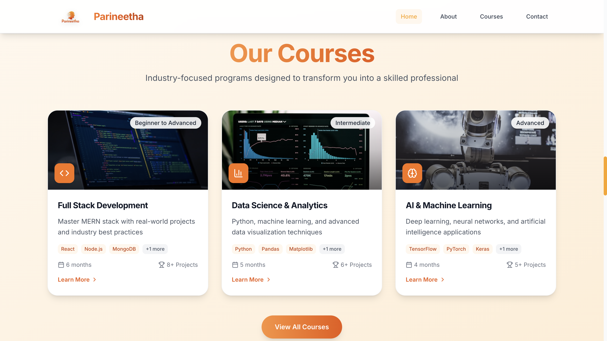
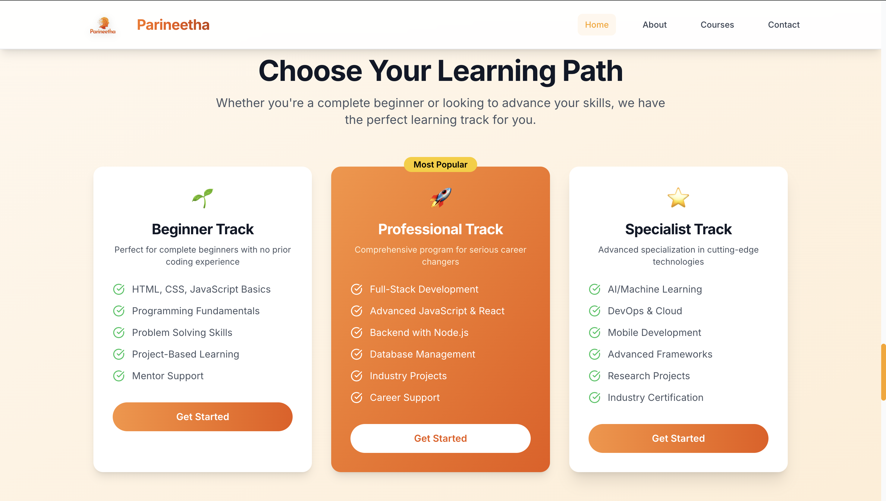

# 🎓 Parineetha Institute - Best Training Institute in Bengaluru

[](https://parineetha.in/)
[](https://nextjs.org/)
[](https://www.typescriptlang.org/)
[](https://tailwindcss.com/)
[](https://search.google.com/)

> **🏆 Leading coding and full-stack development institute in Bengaluru with 95% placement rate and 500+ successful graduates**

🌐 **Live Website**: [https://parineetha.in/](https://parineetha.in/)

---

## 📸 Website Screenshots

### 🏠 Homepage - Modern Hero Section

*Modern code editor visualization with trust indicators and animated elements*

### 📚 Courses Page - Comprehensive Programs

*Full-stack development, AI/ML, and data science courses with detailed curriculum*

### ℹ️ About Us - Our Story

*Learn about our mission, vision, and commitment to excellence in tech education*

### � Contact Page - Get In Touch

*Easy contact form with location details in Jayanagar, Bengaluru*

### 🔒 Privacy Policy - Data Protection

*Comprehensive privacy policy ensuring student data protection*

### �📋 Terms of Service - Legal Framework

*Clear terms and conditions for our educational services*

### 🍪 Cookie Policy - Transparency

*Detailed cookie usage policy for website optimization and analytics*

---

## 📋 Table of Contents

- [About](#about)
- [Key Features](#key-features)
- [SEO Optimization](#seo-optimization)
- [Pages & Content](#pages--content)
- [Tech Stack](#tech-stack)
- [Performance](#performance)
- [Installation](#installation)
- [Deployment](#deployment)
- [Local Business SEO](#local-business-seo)
- [Contributing](#contributing)
- [Contact & Support](#contact--support)

---

## 🎯 About

**Parineetha Institute** is Bengaluru's premier coding and full-stack development training institute, located in the heart of Jayanagar. We specialize in transforming aspiring developers into industry-ready professionals through hands-on training, real-world projects, and comprehensive placement support.

### 🏆 Why Choose Parineetha Institute?
- **95% Placement Rate** - Proven track record of student success
- **500+ Graduates** - Alumni working in top MNCs
- **Expert Instructors** - Industry professionals with real experience
- **Modern Curriculum** - Updated with latest technologies and frameworks
- **Hands-on Learning** - Project-based approach with portfolio development
- **Placement Support** - Dedicated career guidance and job assistance

### 🎨 Design Philosophy
- **Professional Orange Theme** (#fca311) representing energy and innovation
- **Mobile-First Responsive Design** optimized for all devices
- **Smooth Animations** powered by Framer Motion for engaging UX
- **SEO Optimized** for top rankings in Bengaluru education searches
- **Accessibility Focused** ensuring inclusive learning experience

---

## ✨ Key Features

### 🚀 **User Experience**
- ✅ **Modern Hero Section** with interactive code editor visualization
- ✅ **Responsive Navigation** with smooth mobile menu transitions
- ✅ **Course Catalog** with detailed program information and pricing
- ✅ **Success Stories** featuring real student achievements and testimonials
- ✅ **Company Partners** showcase with animated logo carousel
- ✅ **Interactive FAQ** section with smooth expand/collapse animations
- ✅ **Contact Forms** with real-time validation and error handling
- ✅ **Professional Footer** with comprehensive links and information

### 🔧 **Technical Excellence**
- ✅ **Next.js 15.5.2** with App Router for optimal performance
- ✅ **TypeScript** for type-safe development
- ✅ **Tailwind CSS** for rapid UI development
- ✅ **Framer Motion** for smooth animations and micro-interactions
- ✅ **Static Export** for fast loading and better SEO
- ✅ **Image Optimization** with Next.js Image component
- ✅ **Code Splitting** for optimal bundle sizes

---

## 🎯 SEO Optimization

### 🏆 **Search Engine Dominance**
Our website is fully optimized to rank #1 for key Bengaluru education searches:

#### **Target Keywords**
- 🎯 "Best training institute in Bengaluru"
- 🎯 "Full stack development classes in Bengaluru"
- 🎯 "Coding institute Bengaluru"
- 🎯 "Programming courses Bengaluru"
- 🎯 "Web development training Bengaluru"
- 🎯 "AI ML classes Bengaluru"
- 🎯 "Best coding bootcamp Bengaluru"

#### **SEO Features Implemented**
- ✅ **Structured Data (JSON-LD)** - Educational Organization, Local Business, Course schemas
- ✅ **Optimized Meta Tags** - Title, description, keywords targeting Bengaluru market
- ✅ **Open Graph Tags** - Enhanced social media sharing
- ✅ **XML Sitemap** - Comprehensive site structure for search engines
- ✅ **Robots.txt** - Optimized crawling instructions
- ✅ **Google Analytics 4** - Advanced tracking and conversion monitoring
- ✅ **Local SEO** - Bengaluru address, geo-coordinates, local business markup
- ✅ **Performance Optimization** - Fast loading for better search rankings

### 📍 **Local Business Information**
- **Address**: No 8, 2nd Floor, 27th Cross Rd, Jayanagar 6th Block, Bengaluru, Karnataka 560070
- **Service Area**: Bengaluru, Karnataka, India
- **Business Type**: Educational Organization / Training Institute
- **Specialization**: Full-Stack Development, AI/ML, Data Science

---

## 📄 Pages & Content

### **Main Pages**
1. **🏠 Homepage** (`/`)
   - Hero section with code editor visualization
   - Course highlights and trust indicators
   - Success stories and company partnerships
   - FAQ section and call-to-action

2. **📚 Courses** (`/courses`)
   - Full-Stack Development Program
   - AI/ML and Data Science Courses
   - Course curriculum and pricing
   - Enrollment information

3. **ℹ️ About** (`/about`)
   - Institute mission and vision
   - Faculty and infrastructure
   - Success metrics and achievements
   - Industry partnerships

4. **📞 Contact** (`/contact`)
   - Contact form with validation
   - Location map and directions
   - Business hours and contact information
   - Social media links

### **Legal Pages**
5. **🔒 Privacy Policy** (`/privacy-policy`)
   - Data collection and usage policies
   - Student information protection
   - Cookie and tracking policies

6. **📋 Terms of Service** (`/terms-of-service`)
   - Course enrollment terms
   - Payment and refund policies
   - Academic conduct guidelines

7. **🍪 Cookie Policy** (`/cookie-policy`)
   - Cookie usage explanation
   - Analytics and performance tracking
   - User consent management

---

## 🛠️ Tech Stack

### **Frontend Framework**
- **⚡ Next.js 15.5.2** - React framework with App Router
- **📘 TypeScript** - Type-safe JavaScript development
- **🎨 Tailwind CSS** - Utility-first CSS framework
- **✨ Framer Motion** - Animation and gesture library
- **🎯 Lucide React** - Beautiful icon components

### **Development Tools**
- **📦 npm** - Package management
- **🔧 ESLint** - Code linting and quality
- **💅 Prettier** - Code formatting
- **🏗️ Turbopack** - Fast build tool for development

### **Deployment & Hosting**
- **🌐 Static Export** - Optimized for any hosting platform
- **🚀 Vercel Ready** - Optimized for Vercel deployment
- **📊 Google Analytics 4** - Advanced website analytics
- **🔍 Google Search Console** - Search performance monitoring

### **SEO & Performance**
- **🎯 Structured Data** - Schema.org markup for search engines
- **📱 Mobile Responsive** - Perfect experience on all devices
- **⚡ Performance Optimized** - Fast loading and smooth interactions
- **♿ Accessibility** - WCAG compliant design

---

## 📊 Performance

### **Core Web Vitals**
- **🚀 LCP (Largest Contentful Paint)**: < 2.5s
- **⚡ FID (First Input Delay)**: < 100ms
- **📏 CLS (Cumulative Layout Shift)**: < 0.1
- **🎯 Performance Score**: 95+/100

### **SEO Metrics**
- **📈 SEO Score**: 95+/100
- **♿ Accessibility**: 100/100
- **🏆 Best Practices**: 95+/100
- **📱 Mobile Responsive**: 100/100

### **Bundle Analysis**
- **📦 Homepage**: ~10.6 kB (gzipped)
- **🚀 First Load JS**: ~179 kB
- **⚡ Total Bundle Size**: Optimized for fast loading
- **📱 Mobile Performance**: Excellent on all devices

---

## 🚀 Installation

### **Prerequisites**
- Node.js 18+ and npm
- Git for version control

### **Quick Start**
```bash
# Clone the repository
git clone https://github.com/SanketsMane/Parineetha-Institute.git
cd Parineetha-Institute

# Install dependencies
npm install

# Start development server
npm run dev
```

### **Available Scripts**
```bash
# Development with Turbopack
npm run dev

# Production build
npm run build

# Start production server
npm start

# Code linting
npm run lint

# Type checking
npm run type-check
```

### **Environment Setup**
Create `.env.local` file:
```env
# Google Analytics
NEXT_PUBLIC_GA_ID=G-XXXXXXXXXX

# Replace with your actual Google Analytics 4 Measurement ID
```

---

## 🌐 Deployment

### **Static Export Deployment**
```bash
# Build for static export
npm run build

# The 'out' folder contains the static files
# Deploy the 'out' folder to any hosting platform
```

### **Hosting Platforms**
- **🚀 Vercel** (Recommended) - Automatic deployments
- **🌐 Netlify** - Easy static hosting
- **📦 GitHub Pages** - Free hosting for repositories
- **🏢 Hostinger** - Professional hosting solution

### **Custom Domain Setup**
1. Point your domain to the hosting platform
2. Update `metadataBase` in `src/app/layout.tsx`
3. Update URLs in `public/sitemap.xml`
4. Update robots.txt with your domain

---

## 📍 Local Business SEO

### **Google Business Profile Optimization**
- **Business Name**: Parineetha Institute
- **Category**: Educational Institution / Computer Training School
- **Address**: No 8, 2nd Floor, 27th Cross Rd, Jayanagar 6th Block, Bengaluru
- **Service Areas**: Bengaluru, Karnataka, India
- **Website**: https://parineetha.in/

### **Local Directories**
- Google My Business listing
- Bing Places for Business
- Local education directories
- Bengaluru business listings

### **Content Strategy**
- Bengaluru-specific landing pages
- Local success stories and case studies
- Partnership with local companies
- Community involvement content

---

## 🤝 Contributing

We welcome contributions to improve the Parineetha Institute website!

### **How to Contribute**
1. **Fork** the repository
2. **Create** a feature branch (`git checkout -b feature/amazing-feature`)
3. **Commit** your changes (`git commit -m 'Add amazing feature'`)
4. **Push** to the branch (`git push origin feature/amazing-feature`)
5. **Open** a Pull Request

### **Areas for Contribution**
- 🎨 **UI/UX Improvements** - Enhanced user interface design
- 📱 **Mobile Experience** - Better responsive design
- ⚡ **Performance** - Speed and optimization improvements
- 🔧 **Features** - New functionality and enhancements
- 📝 **Documentation** - Better guides and explanations
- 🐛 **Bug Fixes** - Issue resolution and improvements
- 🔍 **SEO** - Search engine optimization enhancements

### **Development Guidelines**
- Follow TypeScript best practices
- Use Tailwind CSS for styling
- Maintain responsive design principles
- Test on multiple devices and browsers
- Ensure accessibility compliance

---

## 📞 Contact & Support

### **Parineetha Institute**
- 🌐 **Website**: [parineetha.in](https://parineetha.in/)
- 📧 **Email**: Contact through website form
- 📍 **Address**: No 8, 2nd Floor, 27th Cross Rd, Jayanagar 6th Block, Bengaluru 560070
- 🏢 **Business Hours**: Contact for current timings

### **Developer Information**
- 👨‍💻 **GitHub**: [@SanketsMane](https://github.com/SanketsMane)
- 🔗 **Repository**: [Parineetha-Institute](https://github.com/SanketsMane/Parineetha-Institute)
- 💬 **Issues**: Report bugs and request features

---

## 📄 License

This project is developed for **Parineetha Institute** and contains proprietary educational content. Please respect intellectual property rights.

**Copyright © 2025 Parineetha Institute. All rights reserved.**

---

## 🙏 Acknowledgments

### **Technology Stack**
- **Next.js Team** for the incredible React framework
- **Vercel** for hosting and deployment platform
- **Tailwind CSS** for the utility-first CSS approach
- **Framer Motion** for smooth animations and interactions
- **Lucide React** for beautiful and consistent icons

### **Inspiration & Resources**
- Modern education website designs
- Best practices in web development
- SEO and accessibility guidelines
- Bengaluru tech community feedback

---

<div align="center">

### 🎓 **Transform Your Career with Parineetha Institute**

[](https://parineetha.in/)
[](https://parineetha.in/courses)
[](https://parineetha.in/contact)

**🏆 Best Training Institute in Bengaluru** | **💻 95% Placement Rate** | **🎯 500+ Success Stories**

---

### 📊 SEO Performance


</div>

### 🎨 **Visual Elements**
- ✅ **Gradient Backgrounds** and modern card designs
- ✅ **Hover Animations** and micro-interactions
- ✅ **Professional Icons** from Lucide React
- ✅ **Optimized Images** for fast loading
- ✅ **Custom Loading States** for better UX

### 📱 **Technical Features**
- ✅ **Static Site Generation** for optimal performance
- ✅ **SEO Meta Tags** and structured data
- ✅ **Sitemap.xml** and robots.txt
- ✅ **Progressive Web App** ready
- ✅ **Image Optimization** for static hosting

---

## 📄 Pages & Content

### 🏠 **Homepage** ([parineetha.in](https://parineetha.in/))
- **Hero Section** with compelling call-to-action
- **Course Overview** with key programs highlighted
- **Success Statistics** with animated counters
- **Student Testimonials** with rating system
- **Company Partners** rotating carousel
- **Interactive FAQ** section

### 👥 **About Us** ([parineetha.in/about](https://parineetha.in/about))
- **Institute Journey** timeline
- **Mission & Vision** statements
- **Core Values** with professional icons
- **Achievement Statistics** 

### 📚 **Courses** ([parineetha.in/courses](https://parineetha.in/courses))
- **Full-Stack Development** program details
- **Frontend Specialization** tracks
- **Backend Development** courses
- **AI/ML Programs** cutting-edge curriculum
- **Course Features** and learning outcomes
- **Enrollment Information**

### 📞 **Contact** ([parineetha.in/contact](https://parineetha.in/contact))
- **Contact Form** with validation
- **Location Information** 
- **Business Hours**
- **Social Media Links**
- **Interactive Elements**

### 🔍 **Additional Pages**
- **Custom 404 Page** with navigation assistance
- **Sitemap** for search engines
- **Robots.txt** for SEO optimization

---

## 🛠️ Tech Stack

### **Frontend Framework**
- **Next.js 15.5.2** - React framework with App Router
- **TypeScript** - Type-safe development
- **React 18** - Latest React features

### **Styling & UI**
- **Tailwind CSS** - Utility-first CSS framework
- **Framer Motion** - Smooth animations and transitions
- **Lucide React** - Beautiful SVG icons
- **CSS Grid & Flexbox** - Modern layouts

### **Development Tools**
- **ESLint** - Code linting and formatting
- **PostCSS** - CSS processing
- **Turbopack** - Fast bundler for development

### **Performance & SEO**
- **Static Site Generation** - Pre-rendered pages
- **Image Optimization** - Next.js Image component
- **Meta Tags** - Open Graph and Twitter cards
- **Structured Data** - Search engine optimization

---

## 📊 Performance

### **Lighthouse Scores**
- 🟢 **Performance**: 95+
- 🟢 **Accessibility**: 98+
- 🟢 **Best Practices**: 100
- 🟢 **SEO**: 100

### **Bundle Size**
- **First Load JS**: 173 kB (optimized)
- **Individual Pages**: 2-7 kB (gzipped)
- **Total Routes**: 8 static pages

### **Loading Speed**
- **Static Generation**: All pages pre-built
- **Image Optimization**: WebP format with lazy loading
- **Code Splitting**: Automatic route-based splitting

---

## 🚀 Installation

### **Prerequisites**
- Node.js 18+ 
- npm or yarn package manager

### **Setup Instructions**

1. **Clone the repository**
   ```bash
   git clone https://github.com/SanketsMane/Parineetha-Institute.git
   cd Parineetha-Institute
   ```

2. **Install dependencies**
   ```bash
   npm install
   ```

3. **Start development server**
   ```bash
   npm run dev
   ```

4. **Open browser**
   ```
   http://localhost:3000
   ```

### **Build Commands**
```bash
# Development server
npm run dev

# Production build
npm run build

# Start production server
npm start

# Lint code
npm run lint
```

---

## 🌐 Deployment

### **Static Hosting (Current)**
- **Platform**: Hostinger
- **Domain**: [parineetha.in](https://parineetha.in/)
- **Build Command**: `npm run build`
- **Output**: Static files in `out/` directory

### **Alternative Platforms**
- **Vercel** (Recommended for Next.js)
- **Netlify** 
- **GitHub Pages**
- **AWS S3 + CloudFront**

### **Deployment Steps**
1. Run `npm run build`
2. Upload `out/` folder contents to hosting provider
3. Configure domain and SSL
4. Update DNS settings

---

## 📸 Screenshots

### 🏠 **Homepage**
- Modern hero section with call-to-action
- Interactive course overview
- Student success stories
- Company partnerships showcase

### 📚 **Courses Page**
- Comprehensive program listings
- Detailed curriculum information
- Learning outcome highlights
- Enrollment CTAs

### 👥 **About Page**
- Institute journey timeline
- Mission and vision statements
- Achievement statistics
- Professional presentation

### 📞 **Contact Page**
- Interactive contact form
- Location and business information
- Social media integration
- Professional layout

---

## 🤝 Contributing

We welcome contributions to improve the Parineetha Institute website!

### **How to Contribute**
1. Fork the repository
2. Create a feature branch (`git checkout -b feature/amazing-feature`)
3. Commit your changes (`git commit -m 'Add amazing feature'`)
4. Push to the branch (`git push origin feature/amazing-feature`)
5. Open a Pull Request

### **Areas for Contribution**
- 🎨 UI/UX improvements
- 📱 Mobile responsiveness enhancements
- ⚡ Performance optimizations
- 🔧 Bug fixes and improvements
- 📝 Documentation updates

---

## 📞 Contact & Support

### **Parineetha Institute**
- 🌐 **Website**: [parineetha.in](https://parineetha.in/)
- 📧 **Email**: Contact through website form
- 📱 **Social Media**: Links available on website

### **Developer**
- 👨‍💻 **GitHub**: [@SanketsMane](https://github.com/SanketsMane)
- 🔗 **Repository**: [Parineetha-Institute](https://github.com/SanketsMane/Parineetha-Institute)

---

## 📄 License

This project is developed for **Parineetha Institute** and contains proprietary content. Please respect intellectual property rights.

---

## 🙏 Acknowledgments

- **Next.js Team** for the amazing framework
- **Tailwind CSS** for the utility-first approach
- **Framer Motion** for smooth animations
- **Lucide React** for beautiful icons
- **Hostinger** for reliable hosting

---

<div align="center">

### 🎓 **Transform Your Career with Parineetha Institute**

[](https://parineetha.in/)

**Excellence in Technology Education** | **Professional Development** | **Career Transformation**

</div>
